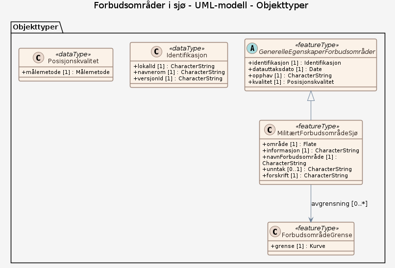

# Produktspesifikasjon: Forbudsområder i sjø

*Datasett i henhold til Forskrift om Forbudsområder i sjø. 
Link til forskriften:
<https://lovdata.no/dokument/LTI/forskrift/2024-06-24-1311>.

Forskriften eies av Forsvarsdepartementet. Forsvarsbygg ivaretar Forsvarets arealbruksinteresser i arealplansammenheng, og det er derfor Forsvarsbygg som distribuerer datasettet i Geonorge.*

**Nøkkelord:** sjø, forbudsområder, forsvaret, Norge digitalt, geodataloven, Det offentlige kartgrunnlaget, fellesDatakatalog, Samfunnssikkerhet, MilitærtForbudsområdeSjø, GenerelleEgenskaperForbudsområder, ForbudsområdeGrense, navnForbudsområde, unntak, forskrift, grense

**Emnekategorier:** Militære data

**Geografisk utstrekning**:

- **Vest**: 2.0
- **Øst**: 33.0
- **Sør**: 57.0
- **Nord**: 72.0

**Tidsmessig utstrekning**:

- **Tidsperiode**:
  - **Fra**: 2020-12-22
  - **Til**: 2024-11-12

## Om spesifikasjonen

> **Denne versjonen av produktspesifikasjonen:**  
> **Opprettet dato:** 2020-12-22 
> **Endret dato:** 2024-11-12 
> **Språk:** nor 
> **Kontaktinformasjon:** Forsvarsbygg, [postmottak@forsvarsbygg.no](mailto:postmottak@forsvarsbygg.no)

## Om produktet Forbudsområder i sjø

> **Romlig representasjonstype:** Vektor 
> **Unik identifikator:** <https://data.geonorge.no/sosi/arealbruk/forbudsomrader_sjo> 
> **Kontaktinformasjon:** Forsvarsbygg, [postmottak@forsvarsbygg.no](mailto:postmottak@forsvarsbygg.no)
>
> **Romlig oppløsning:**
>
> **Ekvivalent målestokk**: 5
>
> **Begrensninger:**
>
> **Juridiske begrensninger**:
>
> - **Tilgangsbegrensninger**: Åpne data
> - **Bruksbegrensninger**: Lisens
> - **Lisens**: No conditions apply to access and use
> - **Lisenslenke**: <http://inspire.ec.europa.eu/metadata-codelist/ConditionsApplyingToAccessAndUse/noConditionsApply>
>
> **Sikkerhetsbegrensninger**:
>
> - **Klassifisering**: Ugradert

### Formål

Datasettet representerer de geografiske områdene som er angitt i forskriften, og formidles i Geonorge for lettere å ivareta Forsvarets arealbruksinteresser.

### Bruksområde

Datasettet er relevant i arealplanarbeid i kystnære strøk, slik som kommuneplaner og fylkesplaner

## Omfang

### Hele datasettet

**Nivå**: dataset

**Nivåbeskrivelse**: Gjelder hele datasettet. Hvis omfang ikke er oppgitt under en overskrift, gjelder teksten for hele datasettet og alle leveranser

### UML-modell

**Nivå**: dataset

## Datainnhold og struktur

### Datamodell - UML-modell

➡️ [Se full datamodell for omfang "UML-modell" (diagram per pakke og objektkatalog)](uml-modell/objektkatalog.html)

## Referansesystem

| EPSG-kode | Navn på referansesystem |
| --- | --- |
| [EPSG:25833](https://epsg.io/25833) | [EUREF89 UTM sone 33, 2d](https://register.geonorge.no/epsg-koder) |
| [EPSG:3035](https://epsg.io/3035) | [EUREF89 / ETRS89-LAEA Europe](https://register.geonorge.no/epsg-koder) |
| [EPSG:4258](https://epsg.io/4258) | [EUREF 89 Geografisk (ETRS 89) 2d](https://register.geonorge.no/epsg-koder) |

## Datakvalitet

**Nivå**: dataset

**Kvalitetsmål**: SOSI produktspesifikasjon: Militære forbudsområder innen sjøforsvaret

- **Beskrivende resultat**: Dataene er i henhold til produktspesifikasjonen

**Kvalitetsmål**: Sosi applikasjonsskjema

- **Beskrivende resultat**: SOSI-filer er i henhold til applikasjonsskjema

**Kvalitetsmål**: Sosi applikasjonsskjema

- **Beskrivende resultat**: GML-filer er i henhold til applikasjonsskjema

**Kvalitetsmål**: Prosentvis dekning i forhold til datasettets utstrekning

- **Målebeskrivelse**: Datasettets faktiske kartlagte areal i forhold til datasettets spesifiserte utstrekning
- **Resultat**: 100%

**Kvalitetsmål**: Prosentvis oppfyllelse av FAIR-prinsipper

- **Målebeskrivelse**: Angir fullstendighet i forhold til krav fra FAIR-prinsippene (The FAIR Guiding Principles for scientific data management and stewardship)
- **Resultat**: 100

## Datafangst og produksjon

**Datainnsamling og prosessering**:

- **Prosesstrinn**:
  - **Beskrivelse**: Militære forbudsområder innen sjøforsvaret er gått gjennom flere prosesser. Data er gjennomgått av Forsvaret, og den følger forskriften fra lovdata med fastsatte koordinater og beskrivelse. Forskriften er hjemlet i Sikkerhetslovens §7-5. Forskriften skal legge til rette for en effektiv kontroll med ferdsel i og omkring viktige områder for Forsvaret.

## Vedlikehold

**Vedlikeholdsfrekvens**: Etter behov

**Status**: Fullført

## Presentasjon

**navn**: Tegneregler

**Lenke**:
<https://register.geonorge.no/register/versjoner/tegneregler/forsvarsbygg/militære-forbudsområder-innen-sjøforsvaret>

## Leveranse

| Tjeneste | Endepunkt | Type | Format | Leveranseenheter |
| --- | --- | --- | --- | --- |
| Geonorge nedlastning | [Lenke](https://nedlasting.geonorge.no/api/capabilities/) | GEONORGE:DOWNLOAD | FGDB, GML, PostGIS, SOSI | landsfiler |
| Atom Feed | [Lenke](http://nedlasting.geonorge.no/geonorge/ATOM-feeds/MilitereForbudsomraderSjo_AtomFeedFGDB.xml) | W3C:AtomFeed | FGDB | landsfiler |
| Atom Feed | [Lenke](http://nedlasting.geonorge.no/geonorge/ATOM-feeds/MilitereForbudsomraderSjo_AtomFeedGML.xml) | W3C:AtomFeed | GML | landsfiler |
| Atom Feed | [Lenke](http://nedlasting.geonorge.no/geonorge/ATOM-feeds/MilitereForbudsomraderSjo_AtomFeedPostGIS.xml) | W3C:AtomFeed | PostGIS | landsfiler |
| Atom Feed | [Lenke](http://nedlasting.geonorge.no/geonorge/ATOM-feeds/MilitereForbudsomraderSjo_AtomFeedSOSI.xml) | W3C:AtomFeed | SOSI | landsfiler |
| Forbudsområder i sjø WMS | [Lenke](https://wms.geonorge.no/skwms1/wms.militereforbudsomradersjo?service=wms&request=getcapabilities) | WMS-tjeneste | PNG |  |
| GeoPackage: uml-modell | [Lenke](https://raw.githubusercontent.com/ToreFreddyB/produktspesifikasjon_forsvarsbygg/main/produktspesifikasjon/forbudsomrader-i-sjo/uml-modell/uml-modell.gpkg) | Nedlasting | GPKG |  |

## Metadata

**Metadatastandard**: ISO19115

**Metadatastandardversjon**: 2003

**Metadatadato**: 2026-09-27

**språk**: nor

**Kontakt**:

- **Organisasjon**: Forsvarsbygg
- **Kontaktperson**: Forsvarsbygg Ressurssenteret Informasjonsforvaltning Geomatikk
- **Logo**: <https://register.geonorge.no/data/organizations/975950662_FB_logo.png>
- **Epost**: geomatikk@forsvarsbygg.no
- **rolle**: pointOfContact

**Metadataidentifikator**:

- **Utsteder**: Geonorge
- **kode**: 35ef918f-ecb2-47ac-953b-1479dc5579c9
- **koderom**: <https://kartkatalog.geonorge.no/metadata/>
- **Metadatalenke**: <https://kartkatalog.geonorge.no/metadata/35ef918f-ecb2-47ac-953b-1479dc5579c9>

## Tilleggsinformasjon

Datasettet inneholder de forbudsområdene som er angitt i forskriften.

- **Produktark:** [https://register.geonorge.no/register/versjoner/produktark/forsvarsbygg/militære-forbudsområder-innen-sjøforsvaret](https://register.geonorge.no/register/versjoner/produktark/forsvarsbygg/militære-forbudsområder-innen-sjøforsvaret)
